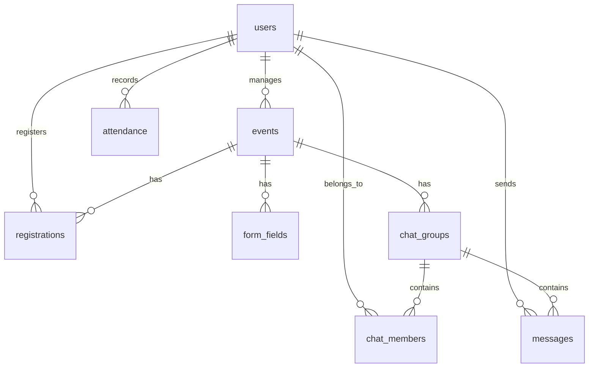

# 📑 Product Requirement Document (PRD) — SiSeminar v2.0
### Sistem Informasi Manajemen Komunikasi Seminar (BaaS InsForge Edition)

---

## 1. Project Overview

| Parameter | Detail |
|---|---|
| **Nama Aplikasi** | SiSeminar (Seminar Communication & Management System) |
| **Deskripsi** | Satu platform Single Page Application (SPA) responsif untuk pendaftaran kustom, interaksi real-time multi-grup chat, rundown, dresscode, presensi aman QR Code, dan kuesioner evaluasi pasca-seminar. |
| **Platform** | Web App (Mobile-First Responsive Layout) |
| **Backend (BaaS)** | [InsForge Cloud](https://insforge.dev) (Auth, PostgreSQL DB, Storage, Real-time WebSockets) |
| **Masalah Utama** | Informasi seminar sering kali tersebar di banyak grup WhatsApp, pendaftaran manual sulit dilacak, presensi rawan kecurangan, dan tidak ada sistem kuesioner terpusat. |
| **Tujuan Utama** | Menyediakan single source of truth yang elegan bagi panitia (admin) untuk mengelola data peserta secara terstruktur dan bagi peserta untuk berinteraksi serta presensi dengan mudah pada hari H. |

---

## 2. Perubahan Fundamental dari Versi 1.0

Berdasarkan perkembangan kebutuhan dan transisi infrastruktur, berikut adalah pembaruan utama di SiSeminar v2.0:

1. **Migrasi Infrastruktur ke InsForge:** Seluruh database PostgreSQL, Autentikasi (termasuk Google OAuth), penyimpanan berkas, dan real-time chat dialihkan ke platform all-in-one **InsForge BaaS**.
2. **Dynamic Form Builder (Admin Only):** Admin memiliki kontrol penuh untuk mendesain field pendaftaran pendaftaran seminar tanpa menyentuh kode.
3. **Multi-Grup Chat per Event:** Admin dapat membuat lebih dari satu grup obrolan per event lengkap dengan deskripsi dan cover banner kustom.
4. **Auto-Join Grup Chat:** Setelah peserta men-submit formulir registrasi kustom, sistem secara otomatis mendaftarkan akun peserta dan memasukkan mereka ke semua grup chat event terkait.
5. **Spreadsheet Dashboard View:** Admin dapat mengelola, memfilter, menyortir, mencari, dan mengekspor seluruh isian peserta dalam tampilan spreadsheet interaktif dengan format ekspor CSV.
6. **QR Code Presensi Dinamis:** Sistem check-in terproteksi token aman berbasis waktu sesi untuk mencegah pemalsuan presensi dari luar aula seminar.

---

## 3. Fitur Utama & Kebutuhan Fungsional (Core Features)

### F1: Autentikasi Pengguna (InsForge Auth)
*   **Registrasi & Login Email:** Pengguna dapat mendaftar dan masuk menggunakan alamat email/Nomor WhatsApp serta password.
*   **Google OAuth:** Integrasi login sekali klik menggunakan akun Google via `signInWithOAuth`.
*   **Session Management:** Sesi pengguna disimpan aman dan otomatis direstorasi saat halaman dimuat ulang.
*   **Peran (Roles):** Hak akses dibagi secara tegas menjadi **Admin** (panitia) dan **Peserta** berdasarkan format email (`*admin*` atau ID statis) dan properti profil database.

### F2: Manajemen Event & Rundown (Admin Panel)
*   **CRUD Event:** Admin dapat membuat detail event dengan input judul, deskripsi, tanggal, lokasi, cover banner, rundown kegiatan, dan info dresscode.
*   **Kode Bergabung Unik:** Setiap event otomatis mendapatkan 6 karakter kode unik (misal: `XJ9K2A`) untuk registrasi peserta langsung.
*   **Penyimpanan Cloud:** Gambar cover event dan dresscode diunggah langsung ke InsForge Storage bucket.

### F3: Pembuat Form Registrasi Dinamis (Dinamis Form Builder)
*   **Desain Tanpa Kode:** Admin dapat merancang formulir pendaftaran khusus per event.
*   **Field Type:** Mendukung field berupa Teks, Angka, Dropdown (dengan opsi JSON), dan Checkbox.
*   **Klausa Persetujuan Wajib:** Setiap form pendaftaran wajib mencantumkan checkbox persetujuan privasi anakku.id yang harus dicentang sebelum data dikirimkan.

### F4: Dashboard Spreadsheet Data Peserta (Admin Only)
*   **Tabel Interaktif:** Seluruh jawaban formulir pendaftaran dan status presensi peserta ditampilkan dalam tabel mirip Excel.
*   **Pencarian & Filter:** Admin dapat melakukan pencarian cepat berdasarkan nama/nomor WA, memfilter berdasarkan event, status check-in, dan menyortir urutan kolom.
*   **Ekspor Data:** Tombol satu kali klik untuk mengekspor data yang tampil ke berkas `.csv`.

### F5: Multi-Grup Chat & Broadcast Pengumuman
*   **Grup Chat Tersegmentasi:** Admin dapat membagi peserta ke beberapa grup chat (misal: grup logistik, grup tanya-jawab, grup umum).
*   **Real-time Messaging:** Logika obrolan real-time terintegrasi WebSocket InsForge.
*   **Broadcast Banner:** Admin dapat mengirim pengumuman berkategori khusus yang disematkan di bagian atas layar grup chat.

### F6: Presensi Digital Terproteksi (QR Code System)
*   **QR Code Dinamis:** Peserta dapat melihat kode QR unik mereka di dashboard.
*   **Scanner Kamera:** Admin menggunakan scan kamera real-time berbasis library `html5-qrcode` di lokasi seminar untuk menandai kehadiran peserta.
*   **Metode Check-in:** Mendukung scan QR otomatis maupun input manual nomor WhatsApp oleh admin apabila kamera terkendala.

---

## 4. Matriks Peran & Hak Akses (Roles & Permissions)

| Fitur / Aksi | Admin (Panitia) | Peserta | Pengunjung Publik |
|---|:---:|:---:|:---:|
| Membuat / Mengubah Event & Rundown | ✅ | ❌ | ❌ |
| Merancang Field Form Registrasi | ✅ | ❌ | ❌ |
| Melihat / Ekspor Spreadsheet Data Peserta | ✅ | ❌ | ❌ |
| Membuat Grup Chat & Upload Banner | ✅ | ❌ | ❌ |
| Melakukan Broadcast Pengumuman | ✅ | ❌ | ❌ |
| Mengirim Pesan Teks & Gambar di Grup | ✅ | ✅ | ❌ |
| Mengisi Formulir Registrasi Seminar | ❌ | ✅ | ✅ *(Membuat akun)* |
| Auto-Join Grup setelah Registrasi | ❌ | ✅ | ❌ |
| Melihat QR Code Presensi Pribadi | ❌ | ✅ | ❌ |
| Melakukan Scan QR Check-in Kehadiran | ✅ | ❌ | ❌ |
| Mengisi Kuesioner Evaluasi Seminar | ❌ | ✅ | ❌ |

---

## 5. Database Schema (PostgreSQL on InsForge)

Arsitektur tabel PostgreSQL diatur secara terstruktur dan dioptimalkan untuk RLS (Row Level Security):



### Detail Deskripsi Kolom Tabel

#### 1. Tabel: `users`
Menyimpan profil akun pengguna terintegrasi InsForge Auth.
*   `id` (UUID/TEXT, Primary Key)
*   `name` (TEXT)
*   `email` (TEXT, Unique)
*   `phone` (TEXT, Unique)
*   `role` (TEXT, ENUM: `'admin'`, `'peserta'`)
*   `created_at` (TIMESTAMP)

#### 2. Tabel: `events`
Menyimpan detail informasi event seminar yang dibuat oleh admin.
*   `id` (TEXT, Primary Key)
*   `title` (TEXT)
*   `description` (TEXT)
*   `date` (DATE)
*   `location` (TEXT)
*   `cover_image` (TEXT, URL dari InsForge Storage)
*   `join_code` (TEXT, 6 karakter alfanumerik)
*   `admin_id` (TEXT, Foreign Key -> `users.id`)
*   `created_at` (TIMESTAMP)

#### 3. Tabel: `form_fields`
Menyimpan konfigurasi field formulir registrasi kustom per event.
*   `id` (TEXT, Primary Key)
*   `event_id` (TEXT, Foreign Key -> `events.id` ON DELETE CASCADE)
*   `label` (TEXT)
*   `field_type` (TEXT, ENUM: `'text'`, `'number'`, `'dropdown'`, `'checkbox'`)
*   `options` (JSONB, menyimpan daftar pilihan untuk field dropdown)
*   `is_required` (BOOLEAN)
*   `placeholder` (TEXT)
*   `order_index` (INTEGER)
*   `created_at` (TIMESTAMP)

#### 4. Tabel: `registrations`
Menyimpan riwayat isian formulir registrasi kustom peserta.
*   `id` (TEXT, Primary Key)
*   `event_id` (TEXT, Foreign Key -> `events.id` ON DELETE CASCADE)
*   `user_id` (TEXT, Foreign Key -> `users.id`)
*   `name` (TEXT)
*   `phone` (TEXT)
*   `responses` (JSONB, menyimpan objek kunci-nilai dari jawaban field dinamis)
*   `status` (TEXT, ENUM: `'pending'`, `'approved'`)
*   `submitted_at` (TIMESTAMP)

#### 5. Tabel: `chat_groups`
Menyimpan konfigurasi grup obrolan per event seminar.
*   `id` (TEXT, Primary Key)
*   `event_id` (TEXT, Foreign Key -> `events.id` ON DELETE CASCADE)
*   `name` (TEXT)
*   `description` (TEXT)
*   `banner_url` (TEXT, URL dari InsForge Storage)
*   `is_locked` (BOOLEAN, jika TRUE hanya admin yang bisa chat)
*   `created_by` (TEXT, Foreign Key -> `users.id`)
*   `created_at` (TIMESTAMP)

#### 6. Tabel: `chat_members`
Daftar relasi keanggotaan peserta di dalam grup chat.
*   `id` (TEXT, Primary Key)
*   `group_id` (TEXT, Foreign Key -> `chat_groups.id` ON DELETE CASCADE)
*   `user_id` (TEXT, Foreign Key -> `users.id`)
*   `joined_at` (TIMESTAMP)

#### 7. Tabel: `messages`
Menyimpan log chat obrolan real-time.
*   `id` (TEXT, Primary Key)
*   `group_id` (TEXT, Foreign Key -> `chat_groups.id` ON DELETE CASCADE)
*   `sender_id` (TEXT, Foreign Key -> `users.id`)
*   `sender_name` (TEXT)
*   `content` (TEXT)
*   `type` (TEXT, ENUM: `'text'`, `'image'`, `'announcement'`)
*   `created_at` (TIMESTAMP)

#### 8. Tabel: `attendance`
Menyimpan log presensi digital kehadiran pada hari H.
*   `id` (TEXT, Primary Key)
*   `event_id` (TEXT, Foreign Key -> `events.id` ON DELETE CASCADE)
*   `user_id` (TEXT, Foreign Key -> `users.id`)
*   `user_name` (TEXT)
*   `user_phone` (TEXT)
*   `method` (TEXT, ENUM: `'qr'`, `'manual'`)
*   `qr_token` (TEXT, Token presensi unik terenkripsi waktu)
*   `checked_in_at` (TIMESTAMP)

---

## 6. Alur Pengguna (User Flow)

### 6.1 Alur Pendaftaran & Auto-Join (Peserta Baru)
```text
[Akses Halaman Register via Join Code]
                  │
                  ▼
[Isi Field Registrasi Kustom & Centang Persetujuan Privasi]
                  │
                  ▼
[Sistem Membuat Akun InsForge Auth + Menyimpan Jawaban di 'registrations']
                  │
                  ▼
[Sistem Otomatis Mendaftarkan Anggota ke 'chat_members' untuk Semua Grup Event]
                  │
                  ▼
[Mengarahkan Pengguna ke Halaman Utama Chat dengan Status Aktif]
```

### 6.2 Alur Presensi Kehadiran QR Code (Hari H)
```text
[Peserta Membuka Menu 'Presensi' di Dashboard] ──> [Sistem Membuat Token QR Dinamis]
                                                                  │
                                                                  ▼
[Admin Membuka Kamera Scanner via Dashboard Admin] <── [Menampilkan QR Code di Layar HP]
                        │
                        ▼
[Scanner Mendekode Token QR & Mengirim Permintaan Verifikasi Check-in]
                        │
                        ▼
[Sistem Menyimpan Data Kehadiran di 'attendance' + Memunculkan Toast Sukses]
```

---

## 7. Aturan Keamanan & Kontrol Akses (Security & RLS)

Demi menjamin keamanan dan privasi data peserta seminar, kebijakan keamanan database diimplementasikan secara berlapis:

1.  **Row Level Security (RLS) pada Registrasi:**
    *   **Select (Read):** Peserta hanya diizinkan membaca data registrasi miliknya sendiri (`user_id = auth.uid()`). Admin diizinkan membaca seluruh baris data.
    *   **Insert (Write):** Diizinkan bagi publik/peserta untuk pendaftaran baru, namun kolom `user_id` otomatis diisi dengan ID pengguna yang terautentikasi.
2.  **Row Level Security (RLS) pada Chat & Message:**
    *   Hanya anggota yang terdaftar di `chat_members` yang dapat membaca pesan dalam `messages` grup terkait.
    *   Hanya admin atau pengguna yang memiliki `sender_id = auth.uid()` yang diizinkan memodifikasi pesan mereka sendiri.
3.  **Unggah Berkas Storage:**
    *   Folder upload di InsForge Storage dibagi menjadi `/banners` (hanya admin yang dapat menulis) dan `/chat` (semua pengguna terautentikasi dapat mengunggah gambar lampiran chat).

---

*PRD ini bersifat dinamis sebagai panduan pengembangan sistem SiSeminar. Setiap pembaruan wajib diselaraskan dengan arsitektur InsForge BaaS.*
